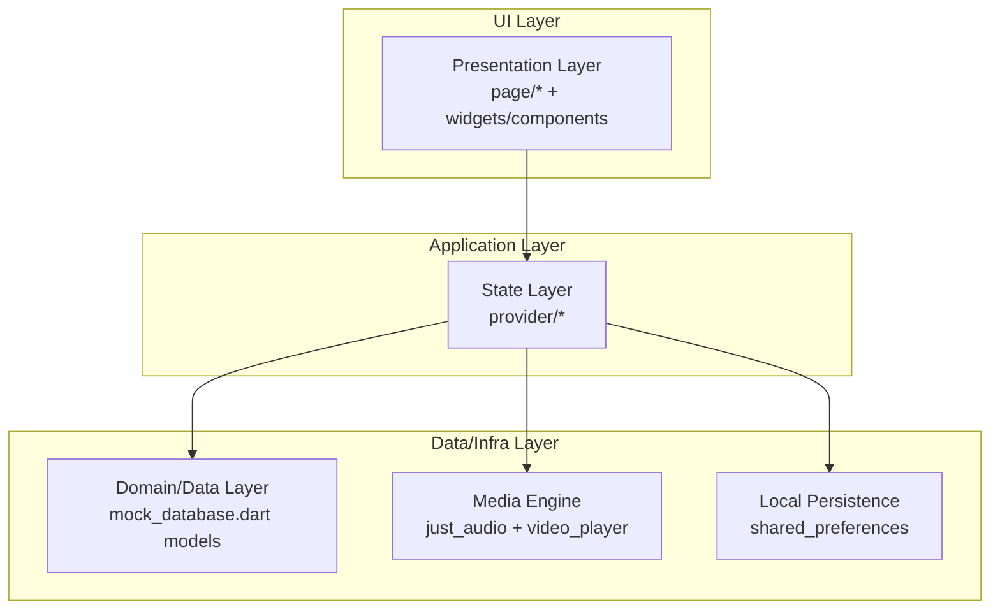
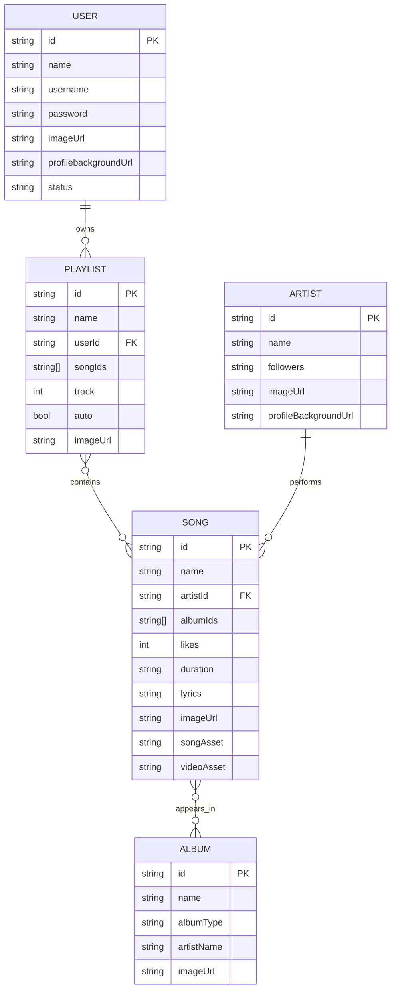
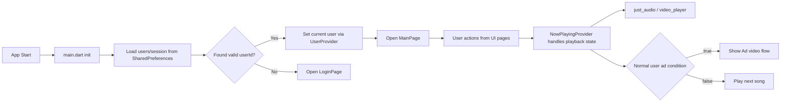
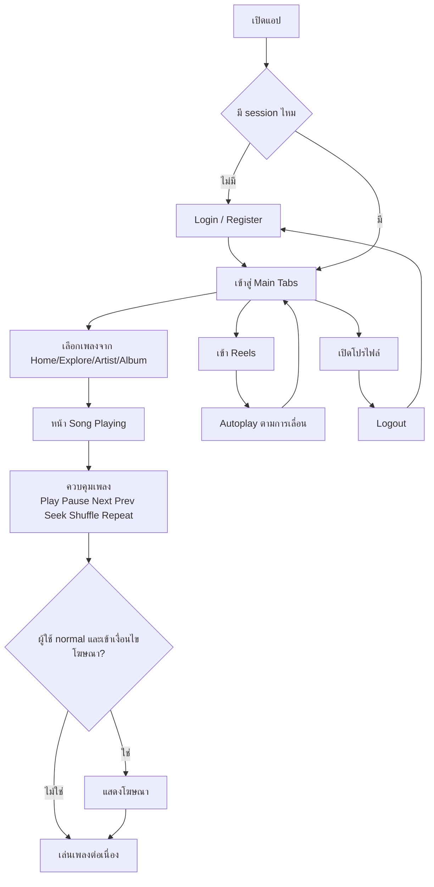

# YouTube Music Clone (Flutter)

โปรเจกต์นี้คือแอปจำลอง YouTube Music ที่พัฒนาด้วย Flutter โดยเน้นประสบการณ์ใช้งานเพลง, Reels, โฆษณาคั่นเพลง, และระบบผู้ใช้แบบ local/mock data

---

## ภาพรวมโปรเจกต์

- **ประเภทโปรเจกต์:** Flutter Mobile/Desktop/Web app
- **จุดเด่น:** Music Player + Queue + Mini Player + Reels + Auth + Role-based UX
- **สถานะข้อมูล:** ใช้ข้อมูล mock/local (`lib/mock_database.dart`) ยังไม่ต่อ backend จริง
- **แพลตฟอร์มที่รองรับ:** Android, iOS, Web, Windows, Linux, macOS

---

## เทคโนโลยีที่ใช้

- **Framework:** Flutter (Dart SDK `>=3.2.3 <4.0.0`)
- **State Management:** `provider` (`ChangeNotifier`)
- **Media:** `just_audio`, `video_player`
- **Persistence:** `shared_preferences`
- **UI:** Material + custom components + Google Fonts
- **Lint:** `flutter_lints`

ดู dependency เพิ่มเติมได้ที่ `pubspec.yaml`

---

## โครงสร้างโปรเจกต์ (แยกชั้น)

```text
lib/
  main.dart                        # App bootstrap, provider injection, route entry
  mock_database.dart               # Mock entities + sample data + local persistence helper

  provider/                        # State/Business layer
    NowPlayingProvider.dart        # Playback state, queue, ads logic, controls
    UserProvider.dart              # User state

  page/                            # Presentation layer (screens/pages)
    Login_page.dart
    Main_page.dart
    Home_page.dart
    Explore_page.dart
    Reels_page.dart
    Library_page.dart
    SongPlaying_page.dart
    ArtistDetail_page.dart
    AlbumDetail_page.dart
    ...

  class/ + components/             # Reusable UI widgets/cards/appbar/miniplayer
  service/                         # Service helpers
  functions/                       # Utilities / lifecycle helpers

assets/
  images/ music/ reels/ ads/ fonts/ preview/
```

---

## ฟีเจอร์หลัก

- Login/Register พร้อมจำ session ผู้ใช้
- Role-based UX (`normal`, `premium`, `admin`)
- Music Player: play/pause, next/prev, seek, shuffle, repeat, queue
- Mini Player และหน้าเล่นเพลงเต็มจอ
- Reels แบบ vertical autoplay ตาม visibility
- โฆษณาคั่นเพลงสำหรับ user ปกติ
- หน้า Home / Explore / Library / Artist / Album / Song Detail

---

## การติดตั้งและรัน

### 1) เตรียมเครื่อง

- ติดตั้ง Flutter SDK และตรวจว่าใช้งานได้

```bash
flutter --version
flutter doctor
```

### 2) ติดตั้ง dependency

```bash
flutter pub get
```

### 3) รันแอป

```bash
flutter run
```

ตัวอย่างระบุอุปกรณ์:

```bash
flutter run -d chrome
flutter run -d windows
```

### 4) ตรวจคุณภาพก่อน push

```bash
flutter analyze
flutter test
```

### 5) Build

```bash
flutter build apk
flutter build ios
flutter build web
```

---

## Architecture Diagram (Layered)



---

## ER Diagram (Logical Data Model)

> โครงสร้างนี้เป็น **logical ER** จาก model ใน `mock_database.dart` (ไม่ใช่ relational DB จริง)



---

## System Flow (แยกชั้นการทำงาน)



---

## User Flow (Flowchart)



---

## Screen Preview

### ScreenRecord

- Music Player: [YouTube Shorts](https://youtube.com/shorts/c7S_JzWDVvg?feature=share)
- Reels: [YouTube Shorts](https://youtube.com/shorts/Vup3-PdHCiE?feature=share)

### Screenshots


---

## ข้อควรระวัง / Known Issues

- Search/History/Download บางส่วนยังเป็น placeholder
- ข้อมูลผู้ใช้ยังเป็น mock และเก็บ password แบบ plain text (เพื่อ demo เท่านั้น)
- test ปัจจุบันยังเป็น template (`test/widget_test.dart`)
- ควรตั้งมาตรฐานชื่อไฟล์ให้คงรูปแบบเดียวกัน (ตัวพิมพ์เล็ก/ใหญ่)

---

## แนวทางขึ้น Git สำหรับทีม

1. รัน `flutter pub get`
2. รัน `flutter analyze` และ `flutter test` ให้ผ่านก่อน commit
3. ตรวจสอบว่า assets อยู่ครบตาม `pubspec.yaml`
4. อัปเดต `README.md` ทุกครั้งที่เพิ่มฟีเจอร์/เปลี่ยน flow หลัก

---

## License

ใช้เพื่อการศึกษาและพอร์ตโฟลิโอเท่านั้น