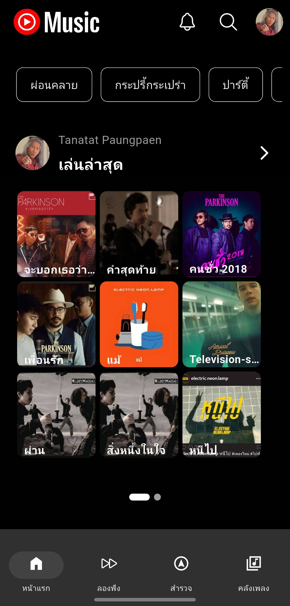
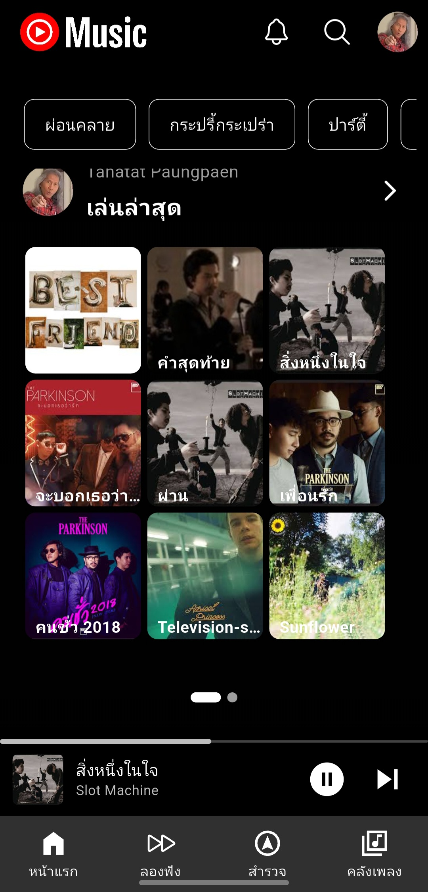
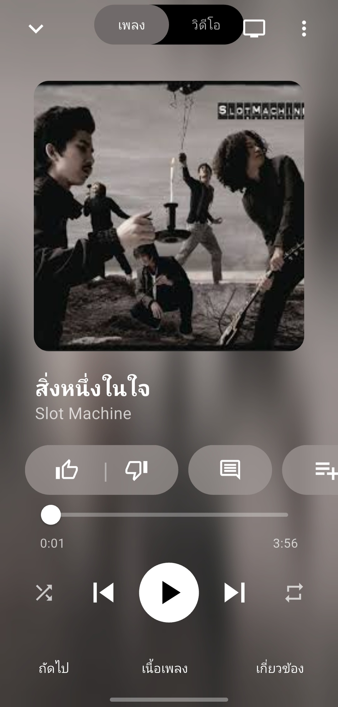
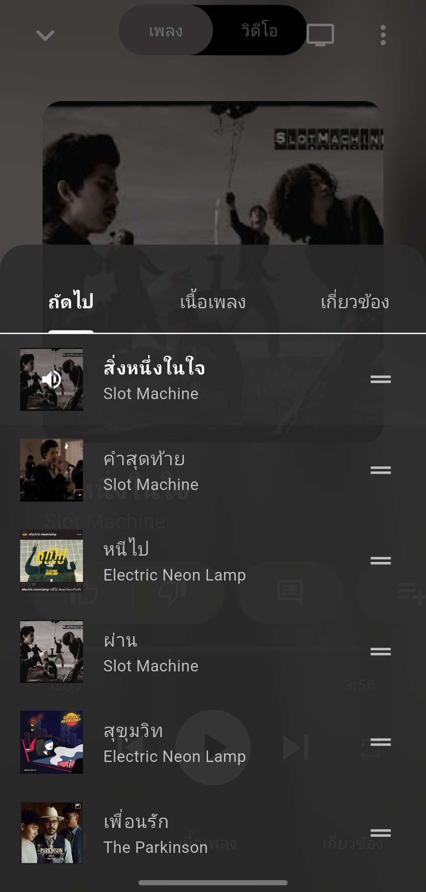
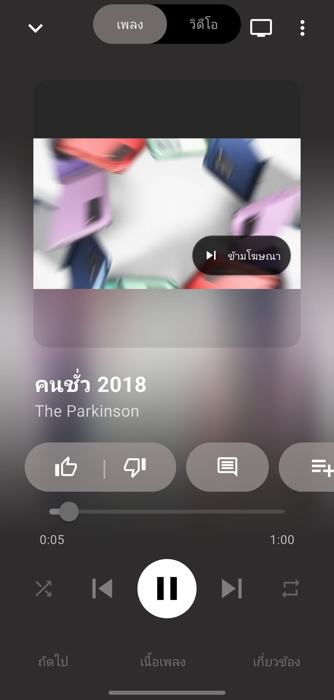

📱 YouTube Music Clone – UI Preview
This repository showcases the UI design and interaction of a YouTube Music clone app. It includes screenshots and a preview clip to demonstrate key features such as reels, playback, playlists, and ads.

📼 ScreenRecord

**Music Player**
<video src="./assets/preview/ScreenRecord_Songplay.mp4" controls width="400"></video>

--

**Reels**
<video src="./assets/preview/ScreenRecord_reels.mp4" controls width="400"></video>

---

🖼️ Screenshots

**Home**

-
**Tab Playing On Navbar**

-
**Music Player**

-
**Music Queue**

-
**Adsversite**

----

🛠️ Tech Stack
- Flutter
- Custom UI components
- Local asset management
🚀 Usage
Use this repository to:
- Reference UI/UX patterns for media apps
- Present design flows in pitch decks or client demos
- Inspire layout ideas for mobile-first experience
